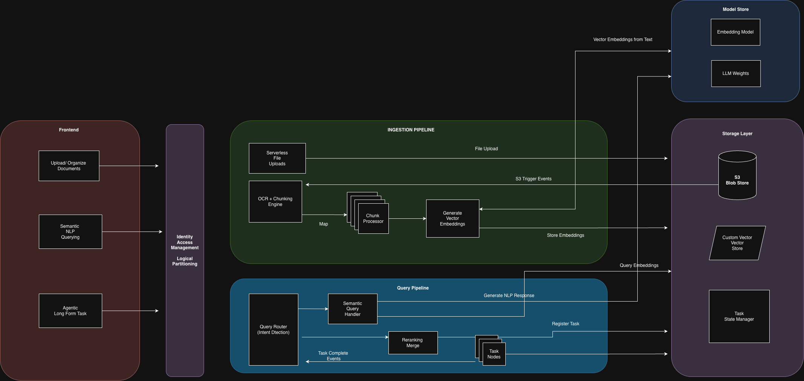
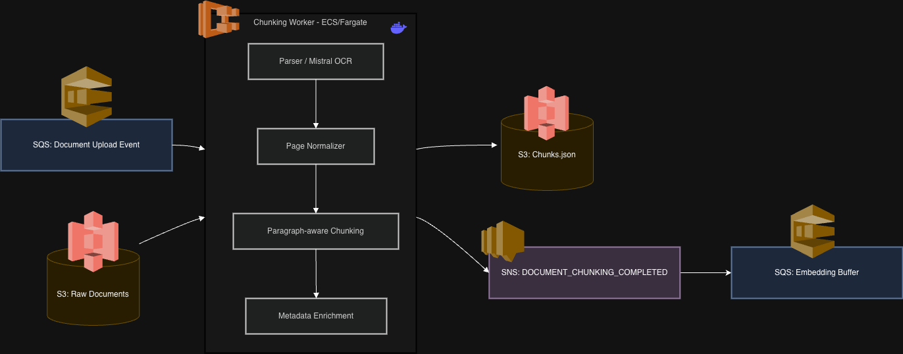
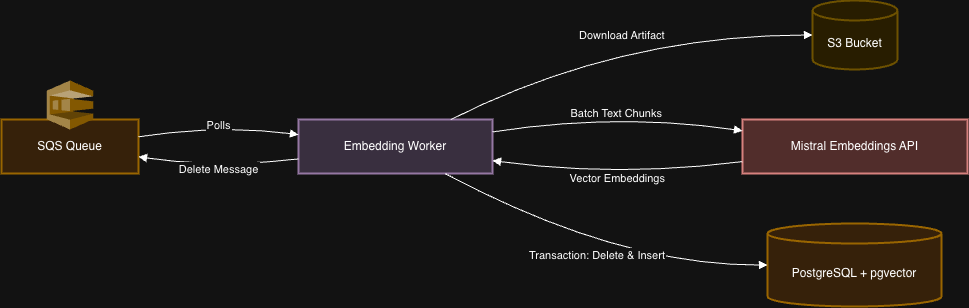
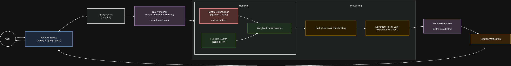

# Stack AI RAG App

lets setup a v1 architecture implementation for the RAG app , this could evovle once we dive deeper



### Dividing into indivisually scalalbale microservices
-  Uploading service
-  Chunking service
-  Embedding service
-  Query Engine

Note: the current ingestion endpoint is a serverless uploader instead of a FastAPI multipart endpoint. The query service itself is FastAPI. This split is intentional because large PDF bytes should go directly to object storage, while FastAPI remains focused on low-latency query traffic.

### SAI-DocUploader
A serverless uploader to push files to object store (S3 for our case).
Endpoint: https://v7rl17dgv1.execute-api.us-east-1.amazonaws.com/default/SAI-docUploader

#### Upload workflow
1. POST metadata to the uploader endpoint.
2. Receive a pre-signed S3 upload URL in the response.
3. PUT the document to S3 using the returned `uploadUrl`.

#### Example metadata request
```bash
curl --location --request POST 'https://v7rl17dgv1.execute-api.us-east-1.amazonaws.com/default/SAI-docUploader' \
  --header 'content-type: application/pdf' \
  --header 'x-doc-filename: acme-nda-v1.pdf' \
  --header 'x-doc-file-size: 204800' \
  --header 'x-doc-client-id: client_acme_001' \
  --header 'x-doc-user-id: user_jane_xyz789' \
  --header 'x-doc-file-type: contract' \
  --header 'x-doc-file-sub-type: nda' \
  --header 'x-doc-doc-type: unstructured' \
  --header 'x-doc-stage: review' \
  --header 'x-doc-parent-folder: deals/2024/q2' \
  --header 'x-doc-uploaded-by: Jane Smith' \
  --header 'x-doc-linked: true' \
  --header 'x-doc-description: Acme Corp NDA for Q2 deal review' \
  --header 'x-doc-tags: [{"key":"region","value":"US"},{"key":"priority","value":"high"}]'
```

#### Example response
```json
{
  "fileId": "1a42c897-28ba-4233-97be-12ef9b3df882",
  "uploadUrl": "https://sai-rag-upload-bucket.s3.us-east-1.amazonaws.com/client_acme_001/deals/2024/q2/1a42c897-28ba-4233-97be-12ef9b3df882.pdf?...",
  "s3Key": "client_acme_001/deals/2024/q2/1a42c897-28ba-4233-97be-12ef9b3df882.pdf",
  "expiresIn": 900,
  "metadata": {
    "fileId": "1a42c897-28ba-4233-97be-12ef9b3df882",
    "clientId": "client_acme_001",
    "userId": "user_jane_xyz789",
    "fileType": "contract",
    "fileSubType": "nda",
    "docType": "unstructured",
    "stage": "review",
    "uploadedBy": "Jane Smith",
    "parentFolder": "deals/2024/q2",
    "description": "Acme Corp NDA for Q2 deal review",
    "tags": [
      { "key": "region", "value": "US" },
      { "key": "priority", "value": "high" }
    ],
    "linked": true,
    "fileName": "acme-nda-v1.pdf",
    "mimeType": "application/pdf",
    "extension": "pdf",
    "fileSize": "204800",
    "s3Key": "client_acme_001/deals/2024/q2/1a42c897-28ba-4233-97be-12ef9b3df882.pdf",
    "s3Bucket": "sai-rag-upload-bucket",
    "uploadStatus": "PENDING"
  }
}
```

#### Upload file to S3
```bash
curl --location --request PUT '<uploadUrl-from-response>' \
  --header 'Content-Type: application/pdf' \
  --form '=@"i_rXjN0Du/Example-file.pdf"'
```


### SAI-Chunking-Service

On file object being created on s3 , event notification is triggered and pushed to a SQS queue (can be replaced with open source alternatives like Kafka/RabbitMQ) 
SQS acts as a buffer to not overwhelm the chunking service and allow it to scale based on incoming requests
The Chunking-Service worker lives in `./SAI-Chunking-Service/app`:



1. Listens to SQS events of S3 object being writed
2. Pickups the S3 object from s3
3. Uses the mistral API to OCR the object 
4. Generates the chunks and stores them to another chunking bucket
5. Informs an SNS to allow the embedder service to pick up the chunks for embedding


- Required env vars:
    - CHUNKING_QUEUE_URL
    - CHUNK_OUTPUT_BUCKET
    - CHUNK_COMPLETE_TOPIC_ARN
    - MISTRAL_API_KEY

- Optional config:
    - MISTRAL_OCR_MODEL
    - CHUNK_TARGET_TOKENS
    - CHUNK_OVERLAP_TOKENS
    - SQS_WAIT_TIME_SECONDS
    - SQS_VISIBILITY_TIMEOUT_SECONDS


### SAI-Embedding-Service



SQS-driven ECS worker that embeds chunk and stores them in PostgreSQL with pgvector. The SNS captures events of completion from chunking service and updates the SQS buffer

1. `chunking-service` writes `chunks.json` to S3.
2. `chunking-service` publishes `DOCUMENT_CHUNKING_COMPLETED` to SNS.
3. SNS delivers the message to the embedding SQS queue.
4. This worker long-polls SQS, downloads the chunk artifact from S3, embeds each chunk with Mistral, and writes rows into `sairag.public.chunks`.
5. The query engine can combine vector search over `embedding` with keyword search over `content_tsv`.

#### table setup

The worker inserts into the table :

```sql
CREATE TABLE chunks (
    chunk_id      UUID PRIMARY KEY DEFAULT gen_random_uuid(),
    file_id       TEXT NOT NULL,
    filename      TEXT NOT NULL,
    client_id     TEXT,
    user_id       TEXT,
    file_type     TEXT,
    file_sub_type TEXT,
    doc_type      TEXT,
    stage         TEXT,
    page_start    INT,
    page_end      INT,
    chunk_index   INT NOT NULL,
    content       TEXT NOT NULL,
    embedding     vector(1024),
    metadata      JSONB DEFAULT '{}'::jsonb,
    content_tsv   tsvector GENERATED ALWAYS AS (to_tsvector('english', content)) STORED,
    created_at    TIMESTAMPTZ DEFAULT now()
);
```

The worker treats a file embedding job as replaceable/idempotent: inside one transaction it deletes existing rows for `file_id`, then inserts the current artifact chunks. This avoids duplicate rows when SQS retries the same completion message.


### SAI-Query-Engine
FastAPI service for querying chunks embedded into PostgreSQL/pgvector.



#### Endpoints

- `GET /health`
- `POST /query`: semantic pgvector retrieval.
- `POST /query/hybrid`: semantic pgvector retrieval plus PostgreSQL full-text keyword retrieval over `content_tsv`.

#### Semantic Query

```bash
curl --location 'http://localhost:8000/query' \
  --header 'Content-Type: application/json' \
  --data '{
    "question": "Is Akshat Tulsani a good fit for stackAI? Stack AI is building ai agents in healthcare and designing rag solutions ",
    "top_k": 5
  }'
```

#### Hybrid Query

```bash
curl --location 'http://localhost:8000/query/hybrid' \
  --header 'Content-Type: application/json' \
  --data '{
    "question": "What does the uploaded document say about termination?",
    "top_k": 5,
    "semantic_weight": 0.65,
    "keyword_weight": 0.35
  }'
```

The keyword side uses `websearch_to_tsquery('english', question)` and `ts_rank_cd(content_tsv, query)`. The final result order is merged with reciprocal rank fusion.

Both query endpoints use multi-query rewriting by default. The original question is always included, and Mistral can generate up to 3 extra retrieval queries. The response includes `rewritten_queries` for debugging

Disable rewriting for debugging:

```json
{
  "question": "What does the uploaded document say about termination?",
  "use_query_rewrite": false
}
```

Post-processing is lightweight: results from the original question and rewritten queries are merged, duplicate chunks are removed by `chunk_id`, and candidates are reranked by the best available retrieval score before selecting the final `top_k`.

#### Answer Shaping

The planner also selects an `answer_style`. The answer model uses that style to shape the final response:

- `factual`: concise prose with citations.
- `summary`: short evidence-backed bullets.
- `list`: wraps a safe HTML list in `<rag-output-list>...</rag-output-list>`.
- `table`: wraps a safe HTML table in `<rag-output-table>...</rag-output-table>`.
- `chart`: wraps a JSON chart spec in `<rag-output-chart>...</rag-output-chart>`.
- `comparison`: compares entities directly, often as a compact table when supported by context.

The UI can parse these wrappers and render richer chat output while the raw answer remains part of the conversation history.

#### Tag-Based Refusal Policy

The query engine keeps refusal policy simple and metadata-driven. After retrieval, it checks citation metadata tags:

- Tags like `pii`, `private`, `confidential`, `personal`, or `sensitive` refuse the answer.
- Tags like `medical`, `health`, `clinical`, or `patient` allow the answer but return a medical disclaimer in `policy_warning`.
- Tags like `legal`, `contract`, `nda`, or `agreement` allow the answer but return a legal disclaimer in `policy_warning`.

Example:

```json
{
  "policy_warning": "Legal/contract document: this is a document summary, not legal advice."
}
```


#### Hallucination Check

After answer generation, the API runs a deterministic citation check. Factual sentences must include a citation like `[1]`, and the citation id must exist in the returned citations. If the answer contains uncited or invalidly cited factual claims, the API returns `insufficient evidence` and includes the flagged sentences in `unsupported_claims`.

```json
{
  "hallucination_warning": "unsupported_or_uncited_claims",
  "unsupported_claims": ["The agreement renews automatically every year."]
}
```


If no retrieved chunk clears `min_similarity`, the API returns:

```json
{
  "answer": "insufficient evidence",
  "used_retrieval": true,
  "insufficient_evidence": true,
  "citations": []
}
```


#### Security and Scalability Notes

- All documents are uploaded and previewed from S3 via pre-signed URLs, there is no service has open access to the documents
- API keys and database credentials are read from AWS Secret Manager which would allow rotation on fly.
- Retrieval can be scoped by `client_id` and `file_id`.
- PII/private document tags block answers after retrieval specific tags can prevent leakage of private information.
- Medical and legal tags return warnings instead of pretending to provide professional advice.
- SQS decouples slow OCR/embedding work from user-facing requests.
- Chunking and embedding workers are idempotent around `file_id`, so retries are safe.


#### Libraries and Software

- [FastAPI](https://fastapi.tiangolo.com/) for query APIs
- [Mistral AI API](https://docs.mistral.ai/) for OCR, embeddings, query planning, rewriting, and answer generation
- [PostgreSQL](https://www.postgresql.org/) for chunk storage and keyword search
- [pgvector](https://github.com/pgvector/pgvector) for vector similarity inside PostgreSQL
- [psycopg](https://www.psycopg.org/psycopg3/) for PostgreSQL access
- [httpx](https://www.python-httpx.org/) for Mistral HTTP calls
- [Pydantic](https://docs.pydantic.dev/) for request/response validation
- [AWS S3](https://aws.amazon.com/s3/), [SQS](https://aws.amazon.com/sqs/), and [SNS](https://aws.amazon.com/sns/) for object storage and event-driven workers
- [Angular](https://angular.dev/) for the chat and document UI


#### Run Locally

- Query Engine

```bash
cd SAI-Query-Engine
python -m venv .venv
. .venv/bin/activate
pip install -r requirements.txt

export MISTRAL_API_KEY=replace-me
export POSTGRES_HOST=replace-me
export POSTGRES_DB=replace-me
export POSTGRES_USER=replace-me
export POSTGRES_PASSWORD=replace-me
export POSTGRES_SSLMODE=require

uvicorn app.main:app --reload --host 0.0.0.0 --port 8000
```

- Chunking Worker

```bash
cd SAI-Chunking-Service
python -m venv .venv
. .venv/bin/activate
pip install -r requirements.txt

export MISTRAL_API_KEY=replace-me
export CHUNKING_QUEUE_URL=replace-me
export CHUNK_OUTPUT_BUCKET=replace-me
export CHUNK_COMPLETE_TOPIC_ARN=replace-me

python -m app.worker
```

- Embedding Worker

```bash
cd SAI-Embedding-Service
python -m venv .venv
. .venv/bin/activate
pip install -r requirements.txt

export MISTRAL_API_KEY=replace-me
export EMBEDDING_QUEUE_URL=replace-me
export POSTGRES_HOST=replace-me
export POSTGRES_DB=replace-me
export POSTGRES_USER=replace-me
export POSTGRES_PASSWORD=replace-me

python -m app.worker
```